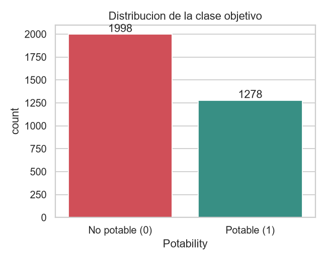
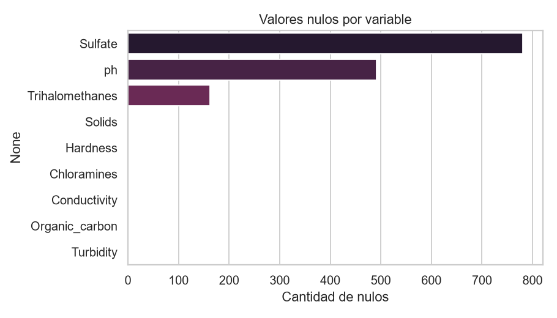
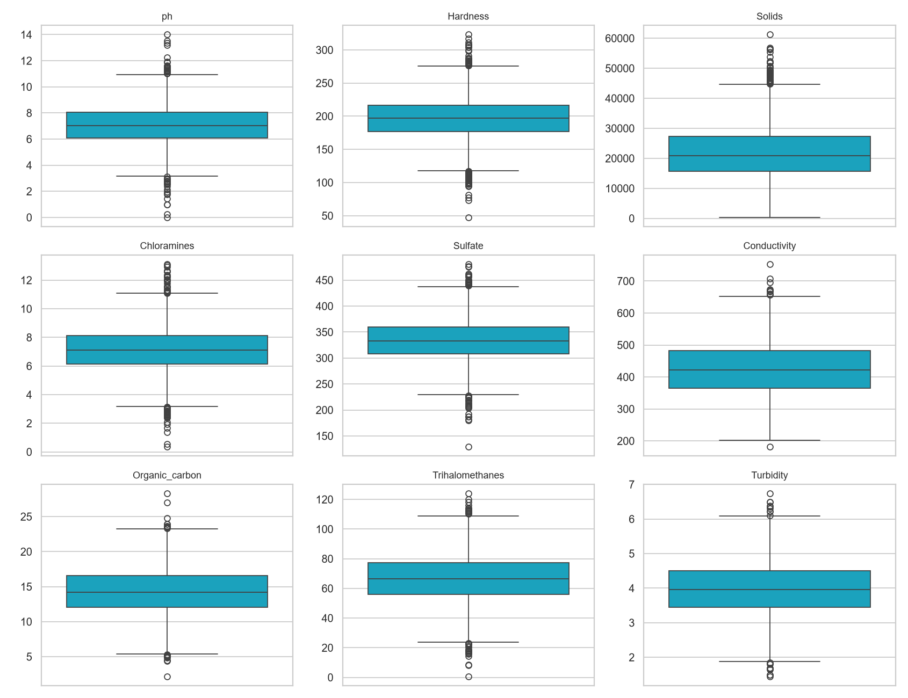
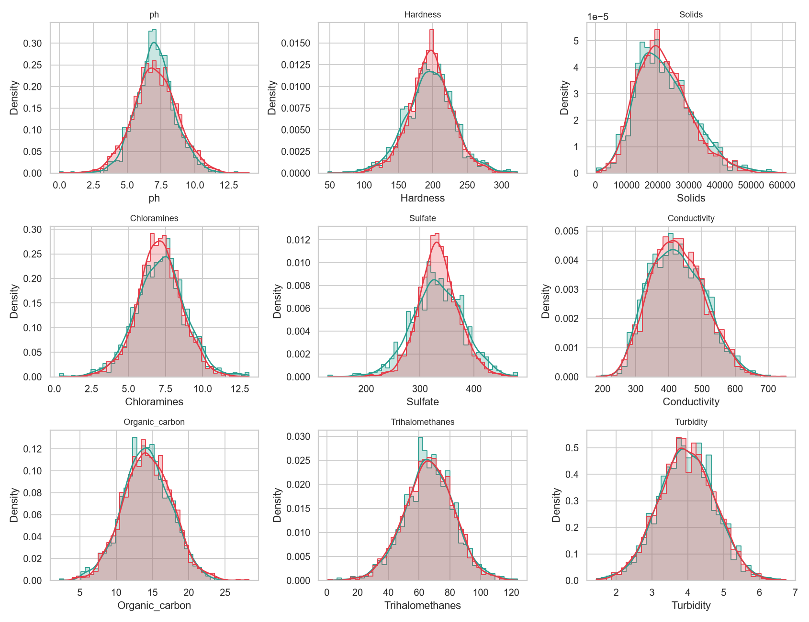
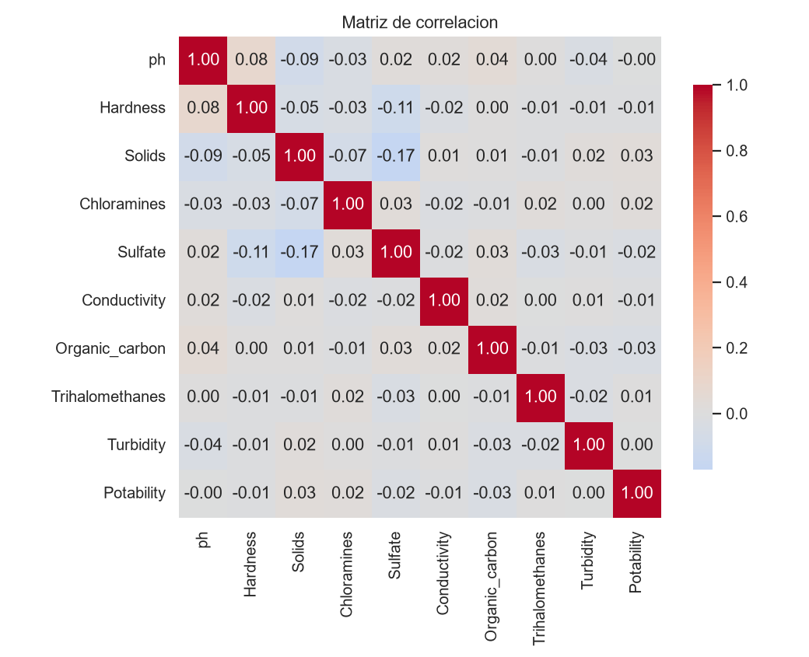
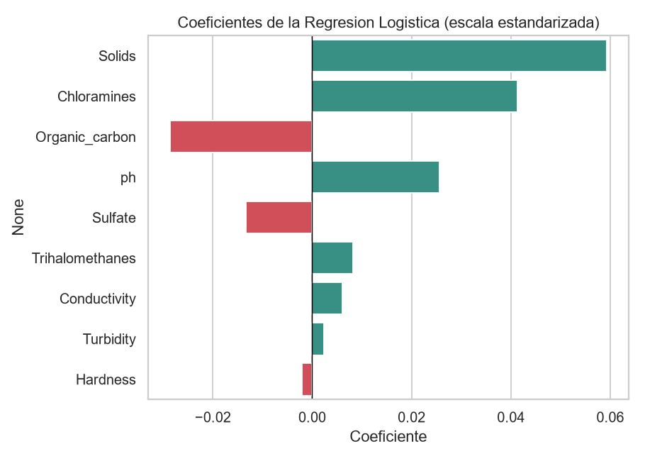
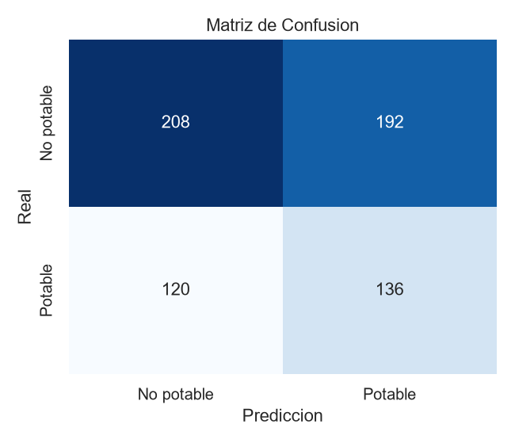
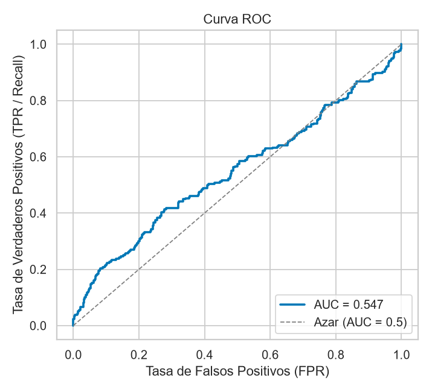

# Clasificación Binaria de Potabilidad del Agua mediante Regresión Logística

**Universidad Andina del Cusco — Escuela Profesional de Ingeniería de Sistemas**
**Curso:** Inteligencia Artificial (2026-II) · **Docente:** Hugo Espetia Huamanga
**Taller 1.2 — Práctica Calificada: Clasificación Binaria con Regresión Logística y Despliegue de Modelo**

**Integrantes:**
- Coavoy Cruz, Joseph Gabriel — [Código]
- Cuchuyrrumi Mamani, Manuel Rodrigo — [Código]
- Huallpatuiro Rafaile, Brayan — [Código]
- Mamani Acuña, Frank Joseph — [Código]

**Fecha:** 02 de septiembre de 2026

---

## 1. Resumen Ejecutivo

Este informe documenta el desarrollo de un clasificador binario de **potabilidad del agua** (potable / no potable) a partir de 9 parámetros fisicoquímicos, usando **Regresión Logística**. Se trabajó sobre el dataset público *Water Potability* (3276 muestras), aplicando imputación de valores faltantes, estandarización y una división estratificada 80/20 en entrenamiento y prueba. El modelo final, entrenado con `class_weight="balanced"` para compensar el desbalance de clases (61% no potable / 39% potable), obtiene en el conjunto de prueba una exactitud de **52.4%**, precisión de **41.5%**, sensibilidad de **53.1%**, F1-score de **46.6%** y un área bajo la curva ROC (AUC) de **0.547**. Estos resultados —apenas superiores al azar— indican que las 9 variables disponibles tienen una relación muy débil, y probablemente no lineal, con la potabilidad real del agua. El modelo entrenado (parámetros de imputación, escalado, coeficientes e intercepto) se exportó a un archivo de datos consumido por una página estática (HTML + JavaScript) que hace la clasificación **en el navegador**, sin coeficientes escritos a mano en el cliente ni backend de por medio; adicionalmente se construyó una versión equivalente en **Streamlit**, lista para desplegarse.

## 2. Definición del Problema

El acceso a agua potable segura es un indicador crítico de salud pública. Confirmar la potabilidad de una muestra mediante ensayos de laboratorio completos es costoso y lento; un modelo que estime la potabilidad a partir de parámetros fisicoquímicos de rutina (pH, dureza, sólidos disueltos, cloraminas, sulfatos, conductividad, carbono orgánico, trihalometanos y turbidez) podría servir como una primera capa de *triage*: priorizar qué muestras requieren análisis de laboratorio urgente o alertar sobre posibles fuentes de agua no aptas para consumo.

El problema se plantea como una **clasificación binaria mutuamente excluyente**:
- **Clase 0 — No potable:** el agua no cumple los estándares de consumo humano.
- **Clase 1 — Potable:** el agua es apta para consumo humano.

**Dataset:** [*Water Potability*](https://www.kaggle.com/datasets/adityakadiwal/water-potability) (Kaggle), 3276 muestras y 9 variables predictoras, sin variables categóricas.

## 3. Análisis Exploratorio y Preparación de Datos

### 3.1 Calidad de los datos

| Variable | Nulos | % del total |
|---|---:|---:|
| ph | 491 | 15.0% |
| Sulfate | 781 | 23.8% |
| Trihalomethanes | 162 | 4.9% |
| (resto de variables) | 0 | 0.0% |

No se encontraron filas duplicadas. El desbalance de la variable objetivo es moderado:

| Clase | Muestras | % |
|---|---:|---:|
| 0 — No potable | 1998 | 61.0% |
| 1 — Potable | 1278 | 39.0% |




### 3.2 Outliers y distribución

El análisis de outliers (método IQR, 1.5×RIC) detecta valores atípicos en todas las variables, siendo `Hardness` (83), `Chloramines` (61) y `Solids` (47) las más afectadas; se optó por **no eliminarlos**, ya que en un problema de calidad de agua los valores extremos pueden ser señal real (contaminación, fuentes atípicas) y no necesariamente errores de medición.




### 3.3 Correlación con la variable objetivo

La matriz de correlación muestra que **ninguna variable individual tiene una relación lineal fuerte con `Potability`**: la correlación máxima en valor absoluto es apenas 0.034 (`Solids`). Esto anticipa que un modelo lineal como la regresión logística tendrá una capacidad predictiva limitada con estas variables.



### 3.4 Preprocesamiento

1. **Imputación de nulos:** `SimpleImputer(strategy="median")` para `ph`, `Sulfate` y `Trihalomethanes`, ajustado **únicamente con el conjunto de entrenamiento** para evitar fuga de información hacia el conjunto de prueba.
2. **Estandarización:** `StandardScaler` sobre las 9 variables numéricas (media 0, desviación 1), también ajustado solo con train.
3. **Codificación de variables categóricas:** no aplica — todas las variables son numéricas.
4. **División del dataset:** `train_test_split` 80/20 **estratificado** por `Potability` (justificado por el desbalance de clases), `random_state=42`. Resultado: **2620 muestras de entrenamiento** (1598 no potable / 1022 potable) y **656 de prueba** (400 no potable / 256 potable).

Todo el preprocesamiento se implementó dentro de un `sklearn.pipeline.Pipeline`, junto con el clasificador, para que el modelo serializado sea autocontenido y reciba datos crudos directamente desde la aplicación web.

## 4. Modelado con Regresión Logística

### 4.1 La función sigmoide

La regresión logística modela la probabilidad de la clase positiva aplicando la función **sigmoide** a una combinación lineal de las variables predictoras:

```
z = β0 + β1·x1 + β2·x2 + ... + β9·x9
σ(z) = 1 / (1 + e^(-z))
```

`σ(z)` comprime cualquier valor real `z` al intervalo (0, 1), interpretable como la probabilidad de que la muestra sea potable. Se clasifica como **Potable** si `σ(z) ≥ 0.5`, y **No potable** en caso contrario.

### 4.2 Configuración del modelo

| Hiperparámetro | Valor | Justificación |
|---|---|---|
| `solver` | `lbfgs` | Solver por defecto de scikit-learn, eficiente para datasets de este tamaño |
| `penalty` | `l2` | Regularización estándar para evitar sobreajuste |
| `class_weight` | `balanced` | El desbalance 61%/39% hacía que el modelo sin ajustar predijera siempre la clase mayoritaria (Precision/Recall/F1 = 0 para "Potable"); balancear los pesos corrige el umbral de decisión efectivo |
| `max_iter` | 1000 | Asegura convergencia del optimizador |
| `random_state` | 42 | Reproducibilidad |

### 4.3 Análisis de coeficientes

Los coeficientes están en la escala estandarizada de las variables, por lo que son directamente comparables entre sí:

| Variable | Coeficiente | Efecto |
|---|---:|---|
| Solids | +0.0593 | Aumenta la probabilidad de potabilidad |
| Chloramines | +0.0413 | Aumenta la probabilidad de potabilidad |
| Organic_carbon | −0.0286 | Reduce la probabilidad de potabilidad |
| ph | +0.0256 | Aumenta la probabilidad de potabilidad |
| Sulfate | −0.0133 | Reduce la probabilidad de potabilidad |
| Trihalomethanes | +0.0082 | Aumenta la probabilidad de potabilidad |
| Conductivity | +0.0061 | Aumenta la probabilidad de potabilidad |
| Turbidity | +0.0024 | Aumenta la probabilidad de potabilidad |
| Hardness | −0.0021 | Reduce la probabilidad de potabilidad |

*Intercepto: −0.0007*



La magnitud de todos los coeficientes es muy pequeña (< 0.06), consistente con las correlaciones casi nulas observadas en el EDA: ninguna variable domina la predicción, y el modelo en conjunto captura muy poca señal.

## 5. Resultados y Discusión de Métricas

Todas las métricas se calcularon sobre el **conjunto de prueba** (656 muestras, no vistas durante el entrenamiento).

### 5.1 Matriz de confusión

| | Predicho: No potable | Predicho: Potable |
|---|---:|---:|
| **Real: No potable** | TN = 208 | FP = 192 |
| **Real: Potable** | FN = 120 | TP = 136 |



### 5.2 Métricas de desempeño

| Métrica | Valor |
|---|---:|
| Accuracy | 52.4% |
| Precision | 41.5% |
| Recall (Sensibilidad) | 53.1% |
| F1-Score | 46.6% |
| AUC-ROC | 0.547 |



### 5.3 Interpretación operativa de los errores

La curva ROC está muy cerca de la diagonal de azar (AUC = 0.547), confirmando que el modelo apenas mejora una predicción aleatoria. En el contexto de potabilidad del agua, los dos tipos de error tienen **costos muy distintos**:

- **Falsos Negativos (FN = 120):** agua realmente potable clasificada como no potable. El costo es principalmente **operativo**: se descarta o se reanaliza innecesariamente una fuente de agua segura.
- **Falsos Positivos (FP = 192):** agua realmente no potable clasificada como potable. El costo es de **salud pública**, mucho más grave: se podría distribuir o consumir agua contaminada creyendo que es segura.

En este modelo, `FP (192) > FN (120)`: el ajuste por `class_weight="balanced"` mejoró la sensibilidad hacia la clase "Potable" pero, como contrapartida, aumentó los falsos positivos — precisamente el error más peligroso en este dominio. Esto sugiere que, antes de cualquier uso operativo real, debería ajustarse el **umbral de decisión** (por encima de 0.5) para privilegiar la detección de agua no potable, aun a costa de accuracy global, o explorar modelos con mejor capacidad discriminativa (ver Conclusiones).

## 6. Manual de Usuario y Arquitectura del Aplicativo

### 6.1 Arquitectura

El aplicativo principal es una página estática (HTML + JavaScript puro) que clasifica **en el navegador**, sin backend ni servidor de por medio. El punto clave de diseño es que el JavaScript **no tiene la fórmula ni los coeficientes escritos a mano**: los lee de un archivo generado automáticamente por el entrenamiento.

```
train_model.py (Python / scikit-learn)
      │  ajusta Imputer -> StandardScaler -> LogisticRegression
      │  sobre el 80% de entrenamiento
      ▼
app_web/modelo_potabilidad.js
  (features, medianas de imputación, media/desviación del escalado,
   coeficientes, intercepto y umbral -- todo como datos, generado por
   el entrenamiento, cero valores hardcodeados en el cliente)
      │
      ▼
app_web/predictor.js  (motor de inferencia genérico)
  predecir(valoresCrudos, modelo):
    impute -> estandariza -> z = intercepto + Σ(coef·x) -> sigmoide(z)
      │
      ▼
app_web/index.html
  construye el formulario dinámicamente a partir de modelo.features
  y muestra clase (Potable / No potable) + probabilidad + el detalle
  de cómo se calculó cada contribución
```

`predictor.js` es **independiente del dataset**: no menciona `ph`, `Solids` ni ningún nombre de variable; simplemente recorre `modelo.features` y aplica la misma transformación que usó `train_model.py`. Si el modelo se reentrena — con otras variables, otro dataset o mejores hiperparámetros — solo cambia `modelo_potabilidad.js`; ni `predictor.js` ni `index.html` necesitan tocarse.

Como alternativa server-side, también se construyó una versión en **Streamlit** (`app.py`) que carga el mismo pipeline serializado (`modelo_potabilidad.pkl`, vía joblib) y ofrece la misma predicción desde Python; ambas implementaciones se verificaron numéricamente equivalentes (mismo caso de prueba, misma probabilidad de salida).

### 6.2 Manual de uso

1. Abrir `app_web/index.html` (o la URL pública una vez desplegada, ver sección 6.3).
2. Completar los 9 campos con los parámetros fisicoquímicos de la muestra de agua, o presionar **"Rellenar con medianas"** para cargar valores de referencia del set de entrenamiento.
3. Presionar **"Predecir potabilidad"**.
4. La página muestra la clase predicha (✅ Potable / ⛔ No potable), la probabilidad estimada y, en **"Ver cómo se calculó"**, el detalle de la contribución de cada variable a la predicción (transparencia sobre el cálculo, no es una caja negra).

La aplicación fue verificada sirviéndola con un servidor estático local: con los valores por defecto (mediana de cada variable) predice **No potable, 49.8%**, y con una muestra real potable del dataset predice **Potable, 53.0%** — ambos resultados idénticos a los que entrega la versión Streamlit sobre los mismos datos, confirmando que el motor de inferencia en JavaScript reproduce exactamente el pipeline entrenado en Python.

### 6.3 Despliegue

**URL pública:** `[pendiente de despliegue]`

Al ser un sitio 100% estático (sin backend), el aplicativo puede publicarse en cualquier hosting gratuito sin necesidad de configurar un servidor: **GitHub Pages** (sirviendo la carpeta `TALLER 1.2/` o `TALLER 1.2/app_web/` del repositorio) o **Netlify**, conectando el repositorio `JigSaw1117/CLAUDIOS`. El despliegue queda pendiente de que el equipo active alguna de estas opciones desde su propia cuenta; una vez publicada, esta sección debe actualizarse con la URL final y capturas de pantalla de la versión en producción.

## 7. Conclusiones y Recomendaciones

- El modelo de regresión logística alcanza un desempeño apenas superior al azar (AUC = 0.547, Accuracy = 52.4%), lo que indica que las 9 variables fisicoquímicas disponibles en este dataset tienen una relación débil —y probablemente no lineal— con la potabilidad real medida en laboratorio. Esta limitación ya era visible en el EDA: ninguna variable individual supera |r| = 0.034 de correlación con el target.
- El ajuste por `class_weight="balanced"` fue necesario para obtener un clasificador que efectivamente distinga ambas clases (sin él, el modelo predecía siempre "no potable"), pero desplazó el error hacia más falsos positivos, el tipo de error más costoso en este dominio.
- **Recomendaciones para trabajo futuro:**
  1. Evaluar modelos no lineales (Random Forest, Gradient Boosting, SVM con kernel RBF) que puedan capturar interacciones entre variables no accesibles a un modelo lineal.
  2. Incorporar ingeniería de atributos (razones e interacciones entre variables, p. ej. pH × Cloraminas).
  3. Ajustar el umbral de decisión de forma explícita para minimizar falsos positivos, dado el costo asimétrico de los errores en salud pública.
  4. De ser posible, ampliar el dataset con variables adicionales (indicadores bacteriológicos, metales pesados) que suelen tener mayor poder predictivo sobre la potabilidad real.

## 8. Anexos

- **Repositorio de código:** [github.com/JigSaw1117/CLAUDIOS](https://github.com/JigSaw1117/CLAUDIOS) — carpeta `TALLER 1.2/`.
- **Dataset original:** [Water Potability — Kaggle](https://www.kaggle.com/datasets/adityakadiwal/water-potability).
- **Archivos del proyecto:** `train_model.py` (entrenamiento), `app_web/` (aplicativo estático: `index.html`, `predictor.js`, `modelo_potabilidad.js/.json`), `app.py` (aplicativo alternativo en Streamlit), `modelo_potabilidad.pkl` (pipeline serializado), `resultados_metricas.json` (métricas completas), `figuras/` (gráficos del EDA y la evaluación).
